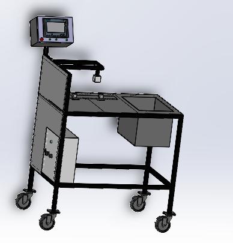
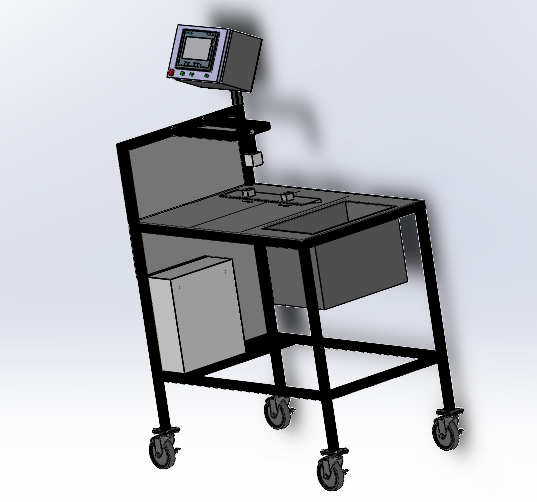
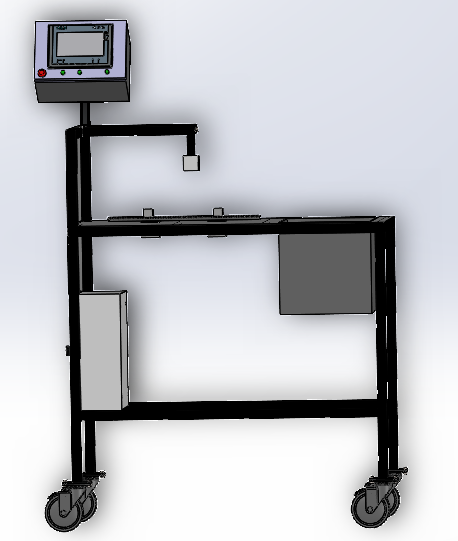

# Conception de la table

## Principales composantes
Comme le montre les figures ci-dessous, la table est composée de 
* une caméra avec support mobile latéralement et verticalement
* zone de fixation de la pièce avec deux capteurs infra afin de fixer et confirmer la présence de la pièce
* une zone de stockage, où mettre les cartons pour l'emballage
* une armoire pour l'automate
* un afficheur

Pour visualiser la totalité de la table, veillez lancer le fichier `Assemblage table.SLDASM`.

## Auteurs
* Behaeddine JOMAA
* Ela ZAYED
* Radhouane ALOUI

